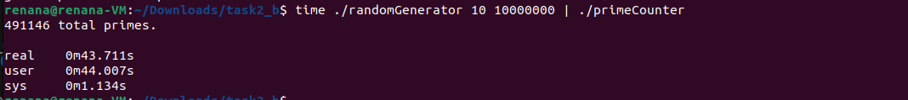
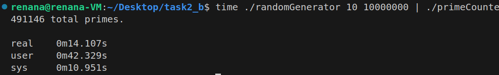
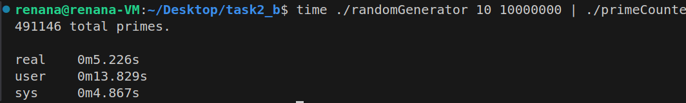

# Prime Number Counting with Multithreading and Memory Constraints

## Table of Contents

- [Overview](#overview)
- [Structure](#structure)
- [Usage](#usage)
- [Build and Run](#build-and-run)
- [Performance Comparison](#performance-comparison)
- [Memory Usage](#memory-usage)
- [Explanation of Key Functions](#explanation-of-key-functions)

## Overview

This project implements a highly efficient, multithreaded application to count prime numbers from an endless data stream, such as security camera data, using minimal memory (2MB RAM). The goal is to fully utilize CPU cores for parallel processing and achieve significant performance improvements.

## Structure

- `primeCounters.c`: Contains the main logic of the application, including thread creation and synchronization.
- `lfq.c`: Implements a lock-free queue to hold the numbers. (We used the hint provided)
- `generator.c`: Simulates the endless stream of random numbers.
- `Makefile`: For building the project.

## Usage

1. **Compile the project**: Use the provided Makefile.
2. **Run the random number generator**: Generates a stream of random numbers.
3. **Run the prime counter**: Processes the stream and counts the prime numbers.

## Build and Run

### Build

To compile the project, run the following command:

```sh
make
```

### Run
To run the random number generator and prime counter, use:

```sh
./randomGenerator <seed> <num_of_numbers> | ./primeCounter
```

Example
```sh
./randomGenerator 10 10000000 | ./primeCounter
```

This will process 10 million numbers generated with the seed 10.

Expected Output
```sh
<total_prime_count> total primes.
```


## Performance Comparison
Reference Performance (Provided primeCounter)
Run the reference implementation and capture the time:

```sh
time ./randomGenerator 10 10000000 | ./primeCounter
```

## Screenshots
Running times of the initial code without changes:


Unchanged runtimes of the isPrime function:


The running times after changing the isPrime function:


## Memory Usage
To ensure memory usage is below 2MB, use tools like valgrind or time with memory profiling options:

```sh
/usr/bin/time -v ./randomGenerator 10 10000000 | ./primeCounter
```


We can see that the Maximum resident set size is below 2048 KB.

## Explanation of Key Functions
isPrime(int n)
Checks if a given number n is a prime number using optimized algorithms for better performance.

inputNumbers(void *arg)
Producer thread function that reads numbers from standard input and pushes them to the queue. Signals the end of input with sentinel values.

outputNumbers(void *arg)
Consumer thread function that processes numbers from the queue, checks for prime numbers, and updates the prime count. Terminates when it encounters a sentinel value.

main()
Sets up the queue, creates the producer and consumer threads, and manages their lifecycle. Prints the total number of prime numbers at the end.
